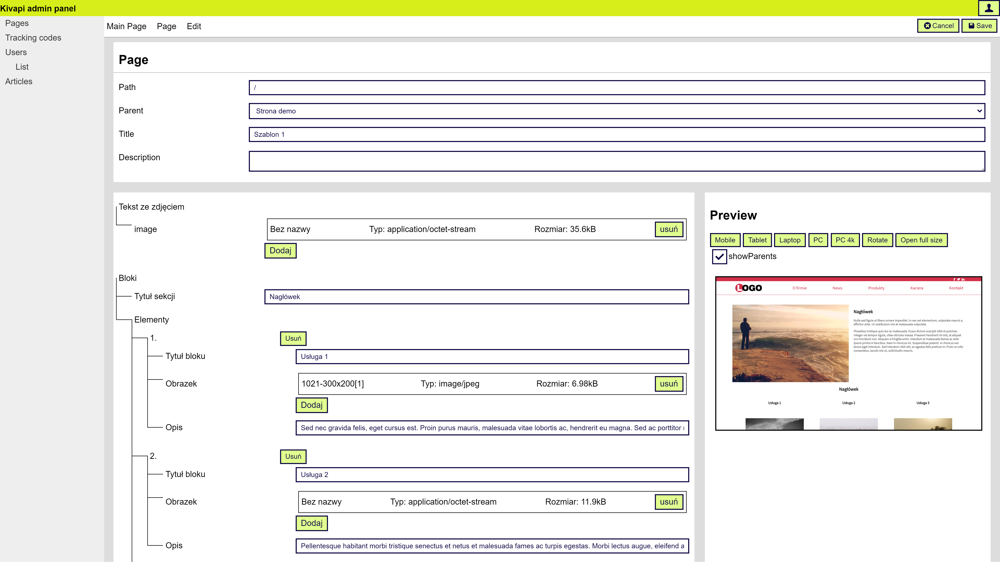

# kivapi
Kivapi is CMS (Content Management System) disigned to be better than Wordpress

## Live demo

(https://demo1.kivapi.green-code.studio/panel/)

Login/email: demo@demo

Password: demo

## Key principes
### Developers friendly
Kivapi was designed, that programmers, who makes websites in plain HTML can put it into Kivapi to allow editing certain elements by user from admin panel.

### Modularity
In case you dont want to write your HTML, you can make website without it only by installing packages.

### Components
Pages are made from multiple components, than can be reuse and mxied together

## Screenshots


## How to start

Firstly, install kivapi-cli uning Composer
```
composer global require kivapi/kivapi-cli
```

Next, you need to have installed Php, Yarn, Git and Node.js. To check it run
```
kivapi status
```

Next, prepare empty MySQL database.

Then you can create new project
```
kivapi create
```

Move to newly created folder
```
cd NameOfProject
```

Install dependencies
```
composer install
```

Create MySQL tables
```
kivapi db upgrade
```

Create admin user account
```
kivapi user add
```

Build
```
kivapi build
```

and then on other console run devserver
```
kivapi devServer
```

## Repositories
* [kivapi-core](https://github.com/GreenCodeStudio/kivapi-core) - main part of this CMS
* [kivapi-clean](https://github.com/GreenCodeStudio/kivapi-clean) - sample clean projects
* [kivapi-cli](https://github.com/GreenCodeStudio/kivapi-cli) - command line tools, installable by composer
* CoreLib - set of official packaged that can be install
  * [kivapi-CoreLib-Article](https://github.com/GreenCodeStudio/kivapi-CoreLib-Article)
  * [kivapi-CoreLib-BasicComponents](https://github.com/GreenCodeStudio/kivapi-CoreLib-BasicComponents)
  * [kivapi-CoreLib-Menu](https://github.com/GreenCodeStudio/kivapi-CoreLib-Menu)
