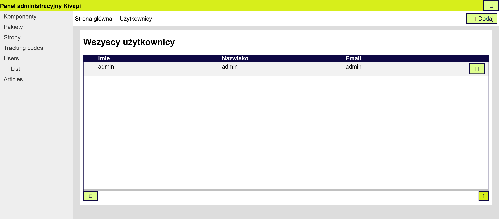

# Admin Panel

Panel is GUI of Kivapi. It allows to manage content of website, users, packages and more. It is available under `/panel`
path of your website.

Panel contains some standard parts, but also each installed Package can add its own part to panel.

